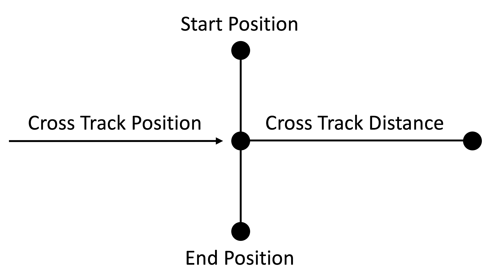
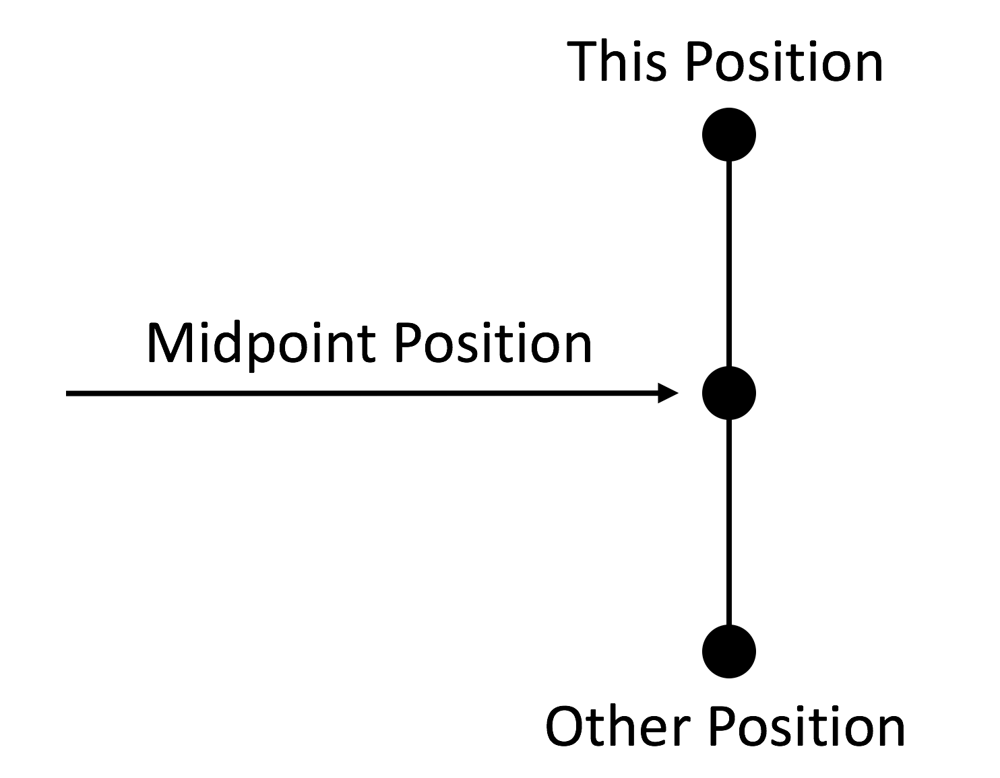

# GreatCircle.NET

[GreatCircle.NET](https://github.com/softwarenerd/GreatCircle.NET) - which is based on the amazing work of [Chris Veness](https://github.com/chrisveness), the owner 
of the [Geodesy functions](https://github.com/chrisveness/geodesy) project - provides a comprehensive set of extension methods to the `BasicGeoposition` struct that
make working with GPS locations and performing calculations on then simple and easy.

(For a more general introduction, see: [Movable Type Scripts Latitude / Longitude Calculations Reference](http://www.movable-type.co.uk/scripts/latlong.html))

#### Status

Thus far, I have worked on porting the spherical-earth model, which provides simple formulae covering the accuracy requirements of most use cases.

## Quick Links

- [Getting Started](#getting-started)
- [Documentation](#documentation)
- [Code of Conduct](CODE_OF_CONDUCT.md)
- [Contributing](#contributing)
- [License](#license)

## Getting Started

GreatCircle.NET should be used via [NuGet](https://www.nuget.org) dependency manager. 

## Documentation

### CrossTrackDistance(thisPosition, startPosition, endPosititon) 

##### Summary

Calculates the cross track distance of this position relative to the specified start position and end position.

##### Returns

The cross track distance of this position relative to the specified start position and end position.

##### Parameters

| Name | Type | Description |
| ---- | ---- | ----------- |
| thisPosition | [BasicGeoposition](#T-Windows-Devices-Geolocation-BasicGeoposition 'BasicGeoposition') | This position. |
| startPosition | [BasicGeoposition](#T-Windows-Devices-Geolocation-BasicGeoposition 'BasicGeoposition') | The start position. |
| endPosititon | [BasicGeoposition](#T-Windows-Devices-Geolocation-BasicGeoposition 'BasicGeoposition') | The end position. |

### CrossTrackPosition(thisPosition, startPosition, endPosititon)

##### Summary

Calculates a position representing the cross track point of this location relative to the specified start position and end position.

##### Returns

A position representing the cross track point of this location relative to the specified start position and end position.

##### Parameters

| Name | Type | Description |
| ---- | ---- | ----------- |
| thisPosition | [BasicGeoposition](#T-Windows-Devices-Geolocation-BasicGeoposition 'BasicGeoposition') | This position. |
| startPosition | [BasicGeoposition](#T-Windows-Devices-Geolocation-BasicGeoposition 'BasicGeoposition') | The start position. |
| endPosititon | [BasicGeoposition](#T-Windows-Devices-Geolocation-BasicGeoposition 'BasicGeoposition') | The end position. |

### DistanceToOtherPosition(thisPosition, position)

##### Summary

Calculates the distance (in meters) between this position and the other position.

##### Returns

The distance (in meters) between this position and the other position.

##### Parameters

| Name | Type | Description |
| ---- | ---- | ----------- |
| thisPosition | [BasicGeoposition](#T-Windows-Devices-Geolocation-BasicGeoposition 'BasicGeoposition') | This position. |
| position | [BasicGeoposition](#T-Windows-Devices-Geolocation-BasicGeoposition 'BasicGeoposition') | The other position. |

### EqualToPosition(thisPosition, position, includeAltitude)

##### Summary

Compares this position to the other position for equality.

##### Returns

true, if the positions are the same; otherwise, false.

##### Parameters

| Name | Type | Description |
| ---- | ---- | ----------- |
| thisPosition | [BasicGeoposition](#T-Windows-Devices-Geolocation-BasicGeoposition 'BasicGeoposition') | This position. |
| position | [BasicGeoposition](#T-Windows-Devices-Geolocation-BasicGeoposition 'BasicGeoposition') | The other position. |
| includeAltitude | [System.Boolean](http://msdn.microsoft.com/query/dev14.query?appId=Dev14IDEF1&l=EN-US&k=k:System.Boolean 'System.Boolean') | A value which indicates whether to include altitude in the comparison. |

### FinalBearingToPosition(thisPosition, position)

##### Summary

Calculates the final bearing (in degrees) between this position and the other position.

##### Returns

The final bearing (in degrees) between this position and the other position.

##### Parameters

| Name | Type | Description |
| ---- | ---- | ----------- |
| thisPosition | [BasicGeoposition](#T-Windows-Devices-Geolocation-BasicGeoposition 'BasicGeoposition') | This position. |
| position | [BasicGeoposition](#T-Windows-Devices-Geolocation-BasicGeoposition 'BasicGeoposition') | The other position. |

##### Remarks

The final bearing will differ from the initial bearing by varying degrees according to distance and latitude.

### InitialBearingToPosition(thisPosition, position)

##### Summary

Calculates the initial bearing (in degrees) between this position and the other position.

##### Returns

The initial bearing (in degrees) between this position and the other position.

##### Parameters

| Name | Type | Description |
| ---- | ---- | ----------- |
| thisPosition | [BasicGeoposition](#T-Windows-Devices-Geolocation-BasicGeoposition 'BasicGeoposition') | This position. |
| position | [BasicGeoposition](#T-Windows-Devices-Geolocation-BasicGeoposition 'BasicGeoposition') | The other position. |

### IntersectionOf(position1, bearing1, position2, bearing2)

##### Summary

Calculates a location representing the point of intersection of two paths, each specified by a location and bearing.

##### Returns

A location representing the point of intersection of two paths, each specified by a location and bearing.

##### Parameters

| Name | Type | Description |
| ---- | ---- | ----------- |
| position1 | [BasicGeoposition](#T-Windows-Devices-Geolocation-BasicGeoposition 'BasicGeoposition') | The first position. |
| bearing1 | [System.Double](http://msdn.microsoft.com/query/dev14.query?appId=Dev14IDEF1&l=EN-US&k=k:System.Double 'System.Double') | The first bearing. |
| position2 | [BasicGeoposition](#T-Windows-Devices-Geolocation-BasicGeoposition 'BasicGeoposition') | The second position. |
| bearing2 | [System.Double](http://msdn.microsoft.com/query/dev14.query?appId=Dev14IDEF1&l=EN-US&k=k:System.Double 'System.Double') | The second bearing. |

### LocationWithBearingAndDistance(thisPosition, bearing, distance)

##### Summary

Calculates a position representing the point that lies at the specified bearing and distance from this position.

##### Returns

A position representing the point that lies at the specified bearing and distance from this position.

##### Parameters

| Name | Type | Description |
| ---- | ---- | ----------- |
| thisPosition | [BasicGeoposition](#T-Windows-Devices-Geolocation-BasicGeoposition 'BasicGeoposition') | This position. |
| bearing | [System.Double](http://msdn.microsoft.com/query/dev14.query?appId=Dev14IDEF1&l=EN-US&k=k:System.Double 'System.Double') | The bearing. |
| distance | [System.Double](http://msdn.microsoft.com/query/dev14.query?appId=Dev14IDEF1&l=EN-US&k=k:System.Double 'System.Double') | The distance. |

### MidpointToPosition(thisPosition, position)

##### Summary

Calculates a position representing the midpoint between this position and the other position.

##### Returns

A position representing the midpoint between this position and the other position.

##### Parameters

| Name | Type | Description |
| ---- | ---- | ----------- |
| thisPosition | [BasicGeoposition](#T-Windows-Devices-Geolocation-BasicGeoposition 'BasicGeoposition') | This position. |
| position | [BasicGeoposition](#T-Windows-Devices-Geolocation-BasicGeoposition 'BasicGeoposition') | The other position. |

## Contributing

GreatCircle is a work in progress and your contributions are most welcome. Feel free to fork the repo and submit PR's.

## License

GreatCircle is released under the [MIT License](LICENSE.md).
